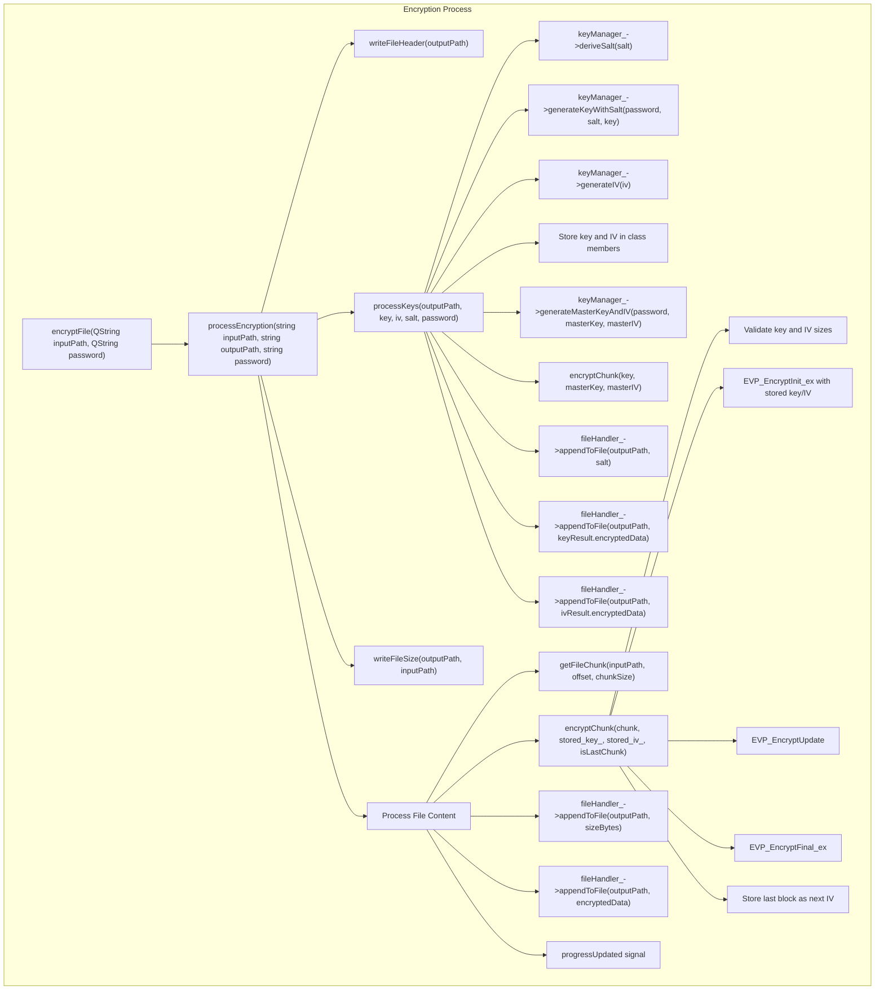
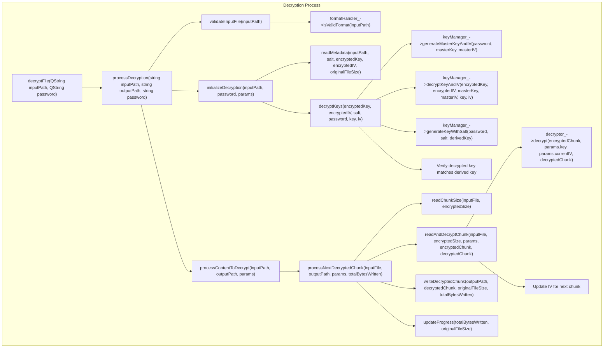

# Crypto Service Documentation

## Process Diagrams

### Encryption Process

### Decryption Process

## Implementation Details

### Encryption Process Flow

1. **Entry Point (`encryptFile`)**
   - Takes input file path and password
   - Creates output file path through user selection
   - Initiates encryption process in a worker thread

2. **Main Process (`processEncryption`)**
   - Writes file header using `writeFileHeader`
   - Processes encryption keys using `processKeys`
   - Writes original file size
   - Processes file content in chunks

3. **Key Processing (`processKeys`)**
   - Generates salt using `deriveSalt`
   - Generates key from password and salt
   - Generates initialization vector (IV)
   - Stores key and IV in class members for chunk encryption
   - Creates master key and IV for key encryption
   - Encrypts and saves the key and IV
   - Stores all metadata in the output file

4. **Content Processing**
   - Reads input file in chunks
   - Encrypts each chunk using AES-256-CBC encryption
   - Uses stored key and IV from key processing phase
   - Validates key and IV sizes before encryption
   - Uses CBC mode with IV chaining
   - Writes encrypted chunk size and data
   - Updates progress through signals
   - Comprehensive error handling with detailed logging

### Decryption Process Flow

1. **Entry Point (`decryptFile`)**
   - Validates input file format
   - Gets output file path from user
   - Initiates decryption process in a worker thread

2. **Validation (`validateInputFile`)**
   - Checks file format signature
   - Verifies file integrity

3. **Initialization (`initializeDecryption`)**
   - Reads file metadata (salt, encrypted key/IV)
   - Decrypts the encryption key and IV
   - Verifies password correctness through key derivation
   - Stores decrypted key and IV in params structure

4. **Content Processing (`processContentToDecrypt`)**
   - Processes file in chunks through `processNextDecryptedChunk`
   - Reads chunk sizes and encrypted data
   - Decrypts chunks using AES decryption
   - Maintains IV chaining for CBC mode
   - Writes decrypted data
   - Updates progress
   - Verifies final file size

### Error Handling and Progress Reporting

Both processes include:
- Comprehensive exception handling
- Detailed error logging at each step
- Progress updates through signals
- Operation completion notification
- Resource cleanup
- Key and IV size validation
- File integrity checks

### File Format Structure

The encrypted file format includes:
1. Signature (3 bytes)
2. Salt (16 bytes)
3. Encrypted Key (48 bytes)
4. Encrypted IV (32 bytes)
5. Original File Size (8 bytes)
6. Encrypted Content (variable size)
   - Each chunk prefixed with its size
   - Chunk data encrypted with AES-256-CBC
   - IV chaining between chunks

### Recent Improvements

1. **Key Management**
   - Added proper storage of encryption key and IV
   - Improved key derivation and verification
   - Enhanced key and IV size validation

2. **Error Handling**
   - Added detailed error logging
   - Improved exception handling
   - Added validation checks for key and IV sizes
   - Better error messages for debugging

3. **Code Organization**
   - Streamlined encryption and decryption flows
   - Improved separation of concerns
   - Enhanced code maintainability

## Requirements
- C++17
- Qt Framework 6
- OpenSSL Library
  
## Demo

https://github.com/user-attachments/assets/07635df2-9e47-4aac-a976-693d0dc554bb

## ScreenShots

