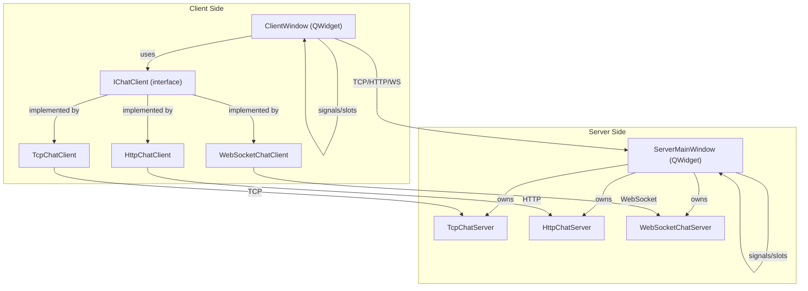
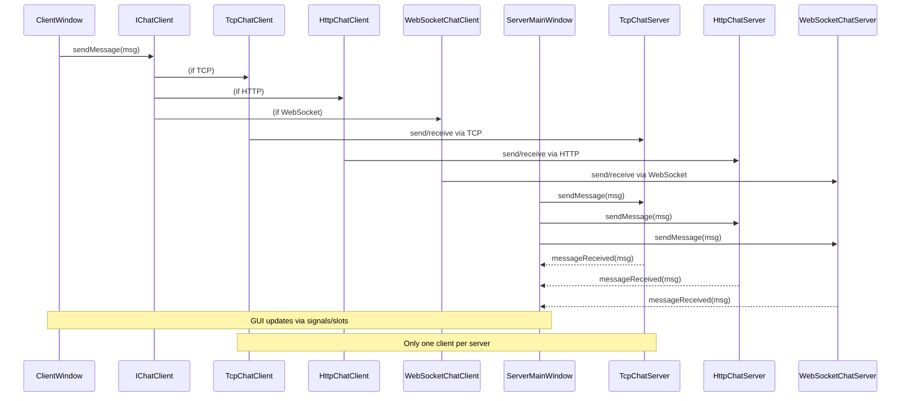

# Qt Network Chat Application

A modern, Qt-based chat application supporting TCP, HTTP, and WebSocket protocols, with both client and server GUIs. Each protocol supports color-coded, two-way chat, and only one client per server is allowed.

## Architecture Overview

- **ClientWindow**: The main client GUI, lets the user connect and chat using TCP, HTTP, or WebSocket.
- **ServerMainWindow**: The main server GUI, monitors and responds to messages for all protocols.
- **IChatClient**: Interface for protocol-specific clients.
- **TcpChatClient/Server, HttpChatClient/Server, WebSocketChatClient/Server**: Handle protocol-specific networking and message delivery.
- **Signals/Slots**: Used for GUI updates and message passing between components.

### Message Handling (v2)

All chat messages are now represented by a centralized `ChatMessage` class, which ensures consistent serialization and deserialization across all protocols. Each message includes a unique ID, sender, and text.

- **Echo Logic:** The server always echoes received messages back to the client, so clients see their own messages in the chat window.
- **Duplicate Filtering:** Clients only mark messages as "seen" when they are actually received from the server, ensuring no messages are missed or duplicated.

## Program Flow (Component Diagram)



## Function Call Hierarchy (Sequence Diagram)



## Protocol-Specific Documentation

For in-depth, protocol-specific details—including function-by-function code walkthroughs, design notes, troubleshooting, and lessons learned—see the following dedicated documentation files:

- [TCP Protocol Documentation](README_TCP.md)
- [HTTP Protocol Documentation](README_HTTP.md)
- [WebSocket Protocol Documentation](README_WEBSOCKET.md)

Each protocol README includes:
- An overview of the protocol's implementation in this project
- Detailed documentation for all public and private functions in the client and server classes
- Code snippets and logic explanations
- Common pitfalls, best practices, and lessons learned
- Testing and usage notes

**Note:** The main README provides a high-level overview. For protocol internals, always refer to the protocol-specific files above.

## Building the Project

1. **Clone or download the project**
2. **Create a build directory:**
   ```bash
   mkdir build
   cd build
   ```
3. **Configure with CMake:**
   ```bash
   cmake ..
   ```
4. **Build the project:**
   ```bash
   cmake --build .
   ```

## Running the Application

1. **Run the built executable:**
   ```bash
   # From the build directory
   ./NetworkTest  # Linux/macOS
   NetworkTest.exe  # Windows
   ```
2. **Two windows will appear:**
   - **Client Window:** Connects to the server using TCP, HTTP, or WebSocket. Type and send messages.
   - **Server Window:** Monitors and interacts with all three protocols. Type and send messages to the client.

## Chat Features

- **Protocols:** TCP, HTTP, WebSocket (see protocol-specific READMEs for details)
- **Color-coded messages:**
  - **Client messages:** White
  - **Server messages:** Dark green
- **Two-way chat:** Both client and server see their own and each other's messages in real time
- **No message duplication:** Each message appears only once per sender
- **Automatic port selection:**
  - TCP: 12345
  - HTTP: 12346
  - WebSocket: 12347

## Project Structure

```
QtNetwork/
├── src/
│   ├── main.cpp
│   ├── gui/
│   │   ├── ClientWindow.cpp
│   │   └── ServerMainWindow.cpp
│   ├── tcp/
│   │   ├── TcpChatClient.cpp
│   │   └── TcpChatServer.cpp
│   ├── http/
│   │   ├── HttpChatClient.cpp
│   │   └── HttpChatServer.cpp
│   └── websocket/
│       ├── WebSocketChatClient.cpp
│       └── WebSocketChatServer.cpp
├── include/
│   ├── ChatMessage.h
│   ├── gui/
│   │   ├── ClientWindow.h
│   │   └── ServerMainWindow.h
│   ├── IChatClient.h
│   ├── tcp/
│   │   ├── TcpChatClient.h
│   │   └── TcpChatServer.h
│   ├── http/
│   │   ├── HttpChatClient.h
│   │   └── HttpChatServer.h
│   └── websocket/
│       ├── WebSocketChatClient.h
│       └── WebSocketChatServer.h
├── CMakeLists.txt
├── README.md
├── README_TCP.md
├── README_HTTP.md
├── README_WEBSOCKET.md
```

## Usage

- **Select protocol** in the client window (TCP, HTTP, WebSocket)
- **Connect** (default IP: 127.0.0.1, port auto-fills)
- **Type and send messages** from either window
- **Messages appear in both windows, color-coded by sender**

## Troubleshooting

- **Port conflicts:** Make sure ports 12345, 12346, and 12347 are not in use
- **Build errors:** Check that your compiler supports C++17 and Qt 6 is installed
- **No Node.js required:** This version is pure Qt/C++

## Features

- Multi-protocol support: TCP, HTTP, WebSocket
- Real-time, two-way, color-coded chat
- Error handling and connection status
- Modern, user-friendly Qt GUI 
